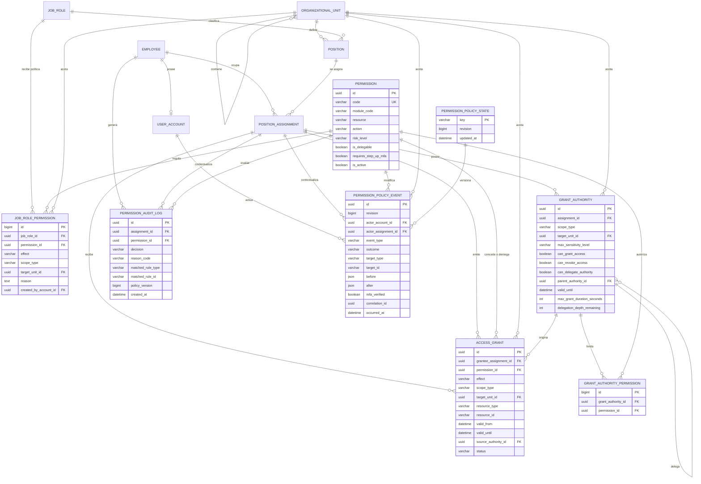

# Módulo de Permisos

`boldApp.permisos` es el plano de control de autorización de Bold. Permite
consultar el catálogo de capacidades, administrar políticas por cargo,
conceder o denegar excepciones individuales, delegar autoridad limitada y
auditar cada cambio. La decisión final de acceso continúa centralizada en
Core para que todos los módulos de contenido apliquen las mismas reglas.

El diseño sigue cuatro principios:

- **Denegar por defecto**: si ninguna regla vigente permite una acción, se
  rechaza.
- **Una asignación por decisión**: los permisos de dos plazas de un mismo
  empleado nunca se combinan.
- **Autoridad explícita y acotada**: `is_staff` solo habilita el Django Admin;
  no concede autoridad empresarial.
- **Trazabilidad completa**: el actor y la asignación se derivan de la sesión,
  nunca de campos enviados por el navegador.

## Responsabilidades y fronteras

| Módulo | Responsabilidad | No le corresponde |
| --- | --- | --- |
| **Core** | Identidad organizacional (`Employee`, `PositionAssignment`, cargos y unidades), catálogo atómico de permisos, modelos estructurales de reglas y motor `resolve_access`/`check_and_log`. | Ofrecer una interfaz mutable genérica para administrar políticas. Los endpoints heredados de permisos en Core son de solo lectura. |
| **Permisos** | Plano de control: políticas por cargo, excepciones individuales, autoridades delegadas, revisión optimista, auditoría de cambios e invalidación. | Crear empleados, cuentas, plazas o unidades; tampoco decide el ciclo de vida de una cuenta. |
| **Administrativo** | Altas, bajas, edición y transferencia de responsabilidades; sesiones, MFA administrativo, organigrama y vista global. Agrega auditorías para consulta. | Definir permisos operativos o convertir `is_staff` en un rol empresarial. |
| **Autenticación** | Sesiones cookie `HttpOnly`, MFA/TOTP, recuperación, expiración y tickets WebSocket de un solo uso. | Resolver permisos de negocio. |
| **Módulos de contenido** | Declaran capacidades y llaman al motor de Core sobre el recurso y unidad reales. | Confiar en visibilidad del frontend o implementar un segundo motor de permisos. |

El dueño (`is_superuser`) es la raíz de confianza inicial del plano de
control. Esto no le da acceso silencioso a tareas u otros datos operativos:
ese acceso debe existir en una política o regla explícita. Un usuario con
`is_staff=True` y `is_superuser=False` no puede modificar políticas.

## Modelo de autorización

### Catálogo y reglas

- `Permission`: capacidad atómica con código normalizado, módulo, recurso,
  acción, nivel de riesgo, estado y marca de delegabilidad. Los permisos de
  sistema se registran por migración/seed; la API no permite inventarlos ni
  eliminarlos.
- Los códigos `permissions.*` quedan reservados e inactivos en esta versión.
  El plano de control se protege con la raíz de dueño y `GrantAuthority`;
  exponer esos códigos como políticas ordinarias permitiría guardar reglas
  sin efecto o crear una ruta ambigua de autoescalamiento.
- `JobRolePermission`: regla base para un cargo. Puede ser `allow` o `deny` y
  admite varios alcances para el mismo permiso.
- `AccessGrant`: excepción para una asignación concreta. A pesar del nombre
  histórico, puede permitir o denegar; puede estar limitada a un recurso y
  siempre conserva emisor, motivo, vigencia y revocación.
- `GrantAuthority`: autoridad para conceder, revocar o subdelegar. Limita
  unidades, sensibilidad, duración, profundidad y capacidades.
- `GrantAuthorityPermission`: allowlist explícita de permisos que cubre una
  autoridad. Una allowlist vacía significa **ningún permiso**, nunca todos.
- `PermissionAuditLog`: decisión de acceso tomada por Core, con regla
  coincidente, revisión, sesión y contexto de solicitud.
- `PermissionPolicyState`: contador global de versión de la política.
- `PermissionPolicyEvent`: bitácora append-only de cambios e intentos
  denegados del plano de control.

### Alcances

| Alcance | Significado |
| --- | --- |
| `global` | Cualquier unidad válida. |
| `own_unit` | Solo la unidad de la asignación evaluada. |
| `specific_unit` | Únicamente la unidad indicada en `target_unit`. |
| `sub_tree` | La unidad indicada y todos sus descendientes. |

Las vigencias usan el intervalo semiabierto `[valid_from, valid_until)`: una
regla deja de ser efectiva exactamente en `valid_until`. Además deben estar
activos la cuenta, el empleado y la asignación. Una concesión emitida desde
una autoridad deja de ser efectiva si esa autoridad o cualquiera de sus
autoridades padre expira o es revocada, aunque el registro de la concesión se
conserve para auditoría.

### Precedencia de decisión

El motor aplica este orden y se detiene en la primera coincidencia:

1. Guardas estructurales: principal inactivo, permiso inactivo, unidad ausente
   o jerarquía inválida producen denegación.
2. `deny` individual vigente (`AccessGrant`).
3. `deny` del cargo (`JobRolePermission`).
4. `allow` individual vigente.
5. `allow` del cargo.
6. Denegación por defecto.

Por tanto, un `allow` individual no puede superar un `deny` del cargo, y un
`deny` individual prevalece sobre cualquier permiso base. Las reglas ligadas
a `resource_id` solo aplican a ese recurso.

### Diagrama de datos

Las tablas de autorización estructural permanecen físicamente en Core para
evitar migraciones destructivas de `app_label`; Permisos las administra
mediante servicios de dominio seguros.



La unión entre `PermissionPolicyState` y `PermissionPolicyEvent` es lógica por
el número de revisión; no existe una llave foránea entre ambas tablas.

## Seguridad del plano de control

- Las operaciones contextualizadas se ejecutan sobre `X-Assignment-ID`; la
  asignación debe pertenecer a la cuenta autenticada y estar activa. Las
  consultas técnicas `revision/` y `catalog/` no necesitan ese encabezado.
- Los campos de actor, otorgante, revocador, sesión e IP se derivan en el
  servidor. No forman parte de los serializers de escritura.
- Nadie puede concederse una regla, delegarse autoridad ni revocar su propia
  regla/autoridad.
- El dueño puede reemplazar políticas por cargo. Los demás usuarios necesitan
  una `GrantAuthority` vigente y una entrada exacta en su allowlist.
- Una subdelegación debe ser un subconjunto de permisos, unidad, sensibilidad,
  capacidades, duración y profundidad de su autoridad padre.
- Una cadena delegada no puede devolver acceso ni autoridad a ninguno de sus
  emisores, incluso si el empleado ocupa varias plazas.
- Una autoridad delegada no puede crear acceso global. Las concesiones
  `allow` individuales y todas las emitidas por delegación deben vencer.
- Duración máxima de un acceso según riesgo: bajo/medio, 7 días; alto, 24
  horas; crítico, 8 horas. La autoridad puede imponer un límite menor.
- Cada cambio exige un motivo de al menos ocho caracteres y se ejecuta dentro
  de una transacción.
- Los registros de auditoría y las reglas revocadas no se borran mediante la
  API; la revocación conserva historia y motivo.

## MFA reciente

Toda mutación de políticas, reglas individuales o autoridades, así como la
lectura de la auditoría completa, exige una sesión con MFA fuerte reciente
(`password_totp` o `webauthn`). Los permisos operativos marcados con
`requires_step_up_mfa` también se muestran como denegados cuando vence esa
confirmación. Por defecto la ventana es de 600 segundos. Los códigos de
recuperación sirven para recuperar el acceso, pero **no** para confirmar una
operación crítica.

Si la ventana expiró, el frontend muestra un formulario de step-up que llama:

```text
POST /api/v2/auth/mfa/step-up/
{ "code": "código TOTP actual" }
```

Una cuenta que aún no tenga MFA debe configurarlo desde el menú de perfil. El
inicio y la confirmación del enrolamiento vuelven a exigir la contraseña
actual. Si ya existe un factor activo, también se exige step-up reciente antes
de agregar otro. El código usado para confirmar el enrolamiento no se puede
reutilizar para el step-up; debe usarse un código TOTP posterior.

## API

Prefijo: `/api/v2/permissions/`. Salvo `revision/` y `catalog/`, las consultas
requieren el encabezado `X-Assignment-ID`. Toda la API requiere una sesión
autenticada mediante cookie.

| Método y ruta | Uso | Autorización |
| --- | --- | --- |
| `GET access/` | Capacidades del actor, estado MFA y revisión. | Asignación propia activa. |
| `GET revision/` | Revisión global actual. | Usuario autenticado. |
| `GET catalog/` | Catálogo de permisos activos. | Usuario autenticado. |
| `GET role-policies/` | Políticas visibles; el dueño ve todos los cargos y los demás su propio cargo. | Asignación propia activa. |
| `POST role-policies/` | Reemplaza atómicamente las reglas de un permiso/cargo. | Solo dueño + MFA reciente. |
| `GET access-rules/` | Lista reglas individuales visibles. | Dueño: todas; delegado: recibidas o emitidas por su asignación activa. |
| `POST access-rules/` | Crea `allow` temporal o `deny` individual. | Dueño; delegado: `can_grant_access` para `allow` y `can_revoke_access` para `deny`, siempre con MFA reciente. |
| `POST access-rules/{id}/revoke/` | Revoca una regla sin borrarla. | Dueño; delegado: `can_revoke_access` para retirar un `allow` y `can_grant_access` para retirar un `deny`, siempre con MFA reciente. |
| `GET authorities/` | Lista autoridades visibles. | Dueño: todas; delegado: propias o emitidas. |
| `POST authorities/` | Crea una autoridad delegada. | Dueño o autoridad `can_delegate_authority` + MFA reciente. |
| `POST authorities/{id}/revoke/` | Revoca autoridad y vuelve inefectivas sus concesiones derivadas. | Dueño o autoridad padre suficiente + MFA reciente. |
| `GET effective/?unit={uuid}` | Explica el acceso efectivo del actor en una unidad. | Asignación propia activa. |
| `GET audit/` | Historial de cambios e intentos denegados; filtros `event_type`, `actor` y `limit`. | Solo dueño + MFA reciente. |

Campos comunes de mutación:

- `reason`: obligatorio, mínimo 8 caracteres.
- `expected_revision`: revisión que mostraba el cliente. Es recomendable
  enviarla siempre.
- `effect`: `allow` o `deny`.
- `scope_type`: `global`, `own_unit`, `specific_unit` o `sub_tree`.
- `target_unit`: obligatorio para `specific_unit`/`sub_tree` y prohibido para
  `global`/`own_unit`.

Una revisión desactualizada devuelve HTTP `409` con código
`policy_revision_conflict`; el cliente debe recargar la política antes de
reintentar. Errores de autoridad o MFA devuelven `403` y también se registran
como eventos denegados cuando corresponda.

## Revisión e invalidación

`PermissionPolicyState` mantiene una revisión global monotónica. En cada
mutación exitosa, dentro de la misma transacción:

1. se bloquea la fila global;
2. se compara `expected_revision`;
3. se persiste el cambio;
4. se incrementa la revisión;
5. se crea `PermissionPolicyEvent` con la misma revisión;
6. después del commit se publica `permission.changed` al grupo Channels
   `permission_watch`.

Los WebSockets de Tareas pertenecen a ese grupo, vuelven a evaluar
`tasks.task.read` y cierran con código `4403` si el acceso fue revocado. Las
señales de Core también invalidan cuando una regla, asignación, posición,
unidad o permiso cambia fuera del servicio de Permisos.

Las decisiones HTTP nunca confían en el caché del navegador. El frontend usa
un caché de cinco segundos, consulta `revision/` cada cinco segundos y lo
vacía inmediatamente tras un cambio realizado en la misma interfaz. Al
cambiar la revisión también vuelve a evaluar y reconstruye las conexiones en
vivo de Tareas, de modo que una concesión o revocación no requiere recargar la
página. La pantalla de Permisos solo acepta un snapshot si todos sus endpoints
reportan la misma revisión; de lo contrario repite la lectura y falla cerrado.
En un
despliegue con varios procesos, `REDIS_URL` debe apuntar a una capa compartida
para propagar la invalidación; sin esa variable se usa una capa en memoria,
adecuada únicamente para desarrollo con un proceso.

## Variables de entorno

| Variable | Predeterminado | Función |
| --- | --- | --- |
| `PERMISSIONS_STEP_UP_MFA_SECONDS` | `600` | Ventana de validez del MFA reciente. |
| `PERMISSIONS_AUTHORITY_MAX_SECONDS` | `7776000` (90 días) | Vigencia máxima de una autoridad nueva. |
| `AUTH_MFA_REQUIRED` | `false` | Obliga a enrolar MFA antes de usar el resto de la aplicación. |
| `SEED_DEMO_ACCOUNTS` | `true` con DEBUG; `false` sin DEBUG | Habilita `seed_demo_data`. Debe mantenerse desactivada en producción. |
| `SEED_PRIVILEGED_DEMO_ACCOUNTS` | `false` | Permite crear cuentas demo privilegiadas fuera de DEBUG. Usar solo en un entorno aislado. |
| `REDIS_URL` | sin valor local | Channel layer compartido para invalidación y cola Celery. |
| `DJANGO_DEBUG` | compatible con `DEBUG` | Control explícito del modo de desarrollo. |

No habilite `SEED_DEMO_ACCOUNTS` ni
`SEED_PRIVILEGED_DEMO_ACCOUNTS` en una base de datos de producción.

## Migración y seed

Desde la raíz del repositorio, en PowerShell:

```powershell
cd backend
..\.venv\Scripts\python.exe manage.py migrate
..\.venv\Scripts\python.exe manage.py seed_demo_data
```

### Preflight e impacto de las migraciones de seguridad

Antes de desplegar, cree un respaldo verificable de la base, ejecute la
migración sobre una copia de staging y revise el plan:

```powershell
cd backend
..\.venv\Scripts\python.exe manage.py showmigrations boldApp_core
..\.venv\Scripts\python.exe manage.py migrate --plan
```

Si `boldApp_core.0003` ya está aplicada, este inventario permite estimar
cuántos registros cerrarán `0004`/`0005`:

```powershell
..\.venv\Scripts\python.exe manage.py shell -c "from boldApp.core.models import AccessGrant, GrantAuthority, Permission; print({'allows_sin_vencimiento': AccessGrant.objects.filter(effect='allow', valid_until__isnull=True).count(), 'autoridades_sin_vencimiento': GrantAuthority.objects.filter(valid_until__isnull=True).count(), 'permisos_legacy_delegables': Permission.objects.filter(is_delegable=True).exclude(code__in={'tasks.task.read','tasks.task.create','tasks.task.update','tasks.task.delete','tasks.task.assign','tasks.comment.create','tasks.project.read','tasks.project.manage','tasks.catalog.read','tasks.webhook.manage'}).count()})"
```

El endurecimiento es deliberadamente *fail-closed*:

- `0003` normaliza alcances/targets inválidos sin convertirlos en acceso
  global, convierte efectos o estados desconocidos en denegación/inactividad
  y no reescribe políticas basándose en el nombre de un cargo.
- `0003` fusiona códigos `Permission` equivalentes por
  mayúsculas/minúsculas (también elimina espacios exteriores), reasigna
  primero todas sus relaciones y conserva `deny` si dos políticas
  convergen.
- Las autoridades heredadas sin vencimiento quedan inactivas y reciben una
  fecha de cierre; se conservan como evidencia, no como poder permanente.
- `0004` deshabilita la delegación de permisos no incluidos explícitamente,
  expira los `allow` permanentes y acota sensibilidad, duración y profundidad
  de delegación. Si un acceso ya estaba revocado, agrega el vencimiento sin
  cambiar su estado `revoked`.
- `0005` repite ese cierre de forma idempotente para instalaciones que ya
  hubieran aplicado una versión previa de `0004` y vuelve obligatorio el
  vencimiento de toda autoridad también a nivel de base de datos.
- `0006` corrige los `correlation_id` duplicados del backfill de auditoría,
  recupera `valid_from` desde `created_at` para autoridades reconocidas como
  heredadas y desactiva los códigos reservados `permissions.*` hasta que
  exista un contrato de autorización que los consuma realmente.
- `boldApp_permisos.0002` enlaza el módulo con Core 0006 sin cambiar la
  dependencia histórica de su migración inicial; esto evita
  `InconsistentMigrationHistory` en bases que ya aplicaron Permisos 0001.

Por ello, después de migrar se deben volver a emitir mediante la API las
autoridades o concesiones temporales que sigan justificadas. No se recomienda
modificar manualmente las filas cerradas: la nueva emisión conserva mejor la
trazabilidad y exige MFA reciente.

Si el entorno no está en DEBUG, la seed exige habilitación explícita. Hágalo
solo para una base aislada:

```powershell
$env:SEED_DEMO_ACCOUNTS = "true"
$env:SEED_PRIVILEGED_DEMO_ACCOUNTS = "true"
..\.venv\Scripts\python.exe manage.py seed_demo_data
```

La seed es idempotente respecto a cuentas y no reemplaza contraseñas que ya
fueron cambiadas. Sí reconstruye los perfiles demo de permisos de Tareas para
mantenerlos coherentes.

### Cuentas demo definidas por la seed

| Cuenta | Contraseña inicial | Perfil relevante |
| --- | --- | --- |
| `luis@bold.gt` | `LuisBold2026!` | Dueño; administra el plano de control. |
| `paulus@bold.gt` | `PaulusBold2026!` | Alta Gerencia; lectura global limitada, sin autoridad de dueño. |
| `developer@bold.gt` | `DeveloperBold2026!` | Desarrollador local; permisos globales de Tareas, sin autoridad administrativa. |
| `ana@bold.gt`, `carla@bold.gt`, `samuel@bold.gt` | `bolddemo123` | Colaboradores de Marketing. |
| `david@bold.gt`, `josue@bold.gt` | `bolddemo123` | Colaboradores de Operaciones. |

Luis, Paulus y Developer solo se crean con DEBUG o con
`SEED_PRIVILEGED_DEMO_ACCOUNTS=true`. Estas credenciales son públicas dentro
del repositorio y no deben reutilizarse en ningún entorno compartido. Si esas
cuentas ya existían y se ejecuta la seed sin habilitar perfiles privilegiados,
la seed las desactiva, elimina sus flags elevados e inutiliza sus contraseñas
conocidas.

## Guía de prueba manual

Use una base local desechable, el frontend configurado con backend real y el
puerto oficial `http://localhost:5174`.

1. Ejecute migraciones y seed.
2. Inicie sesión como `luis@bold.gt` y seleccione su asignación de Dirección.
3. Desde el menú de perfil, confirme la contraseña actual, configure MFA con
   una aplicación TOTP y guarde los códigos de recuperación fuera de la
   pantalla.
4. Abra **Permisos**. Si aparece “Confirmación MFA requerida”, introduzca un
   código TOTP nuevo. Verifique que aparecen las pestañas de políticas,
   accesos individuales, autoridades y auditoría.
5. En **Políticas por cargo**, seleccione un cargo y permiso de prueba, defina
   efecto y alcance, escriba un motivo y guarde. Confirme que cambia la
   revisión y aparece un evento de auditoría con Luis como actor.
6. En **Autoridades**, delegue a Paulus únicamente `tasks.task.read` sobre el
   subárbol de Marketing, con sensibilidad media, vencimiento corto,
   capacidades de conceder y revocar acceso, y sin capacidad de subdelegar.
7. Cierre sesión, entre como Paulus, configure/valide MFA y abra **Permisos**.
   Debe poder crear o revocar accesos solo dentro de la autoridad recibida.
8. Con Paulus, conceda temporalmente `tasks.task.read` a Samuel sobre
   Marketing. Intente después conceder `tasks.task.update`, usar Operaciones o
   concederse acceso a sí mismo: el backend debe responder `403` y no crear la
   regla.
9. Regrese como Luis y revoque la autoridad de Paulus. El acceso emitido desde
   esa autoridad debe dejar de ser efectivo inmediatamente, aunque siga
   visible como registro histórico.
10. Entre como `developer@bold.gt`: debe conservar el perfil operativo de
    Tareas, pero no obtener administración de políticas. Repita con Paulus sin
    autoridad para comprobar que un cargo alto tampoco equivale al dueño.
11. En la pestaña **Auditoría** de Luis, verifique actor, objetivo, motivo,
    resultado, MFA y número de revisión tanto para operaciones aceptadas como
    para intentos denegados.

Para comprobar concurrencia, abra Permisos en dos pestañas con Luis, haga un
cambio en la primera y, sin recargar la segunda, intente guardar una política:
la segunda debe recibir `409`; tras recargar podrá aplicar el cambio sobre la
revisión actual.

## Pruebas automatizadas

Ejecutar solo el módulo:

```powershell
cd backend
..\.venv\Scripts\python.exe manage.py test boldApp.permisos.tests -v 2
```

La matriz adversarial cubre, entre otros casos, ausencia de escalamiento por
`is_staff`, actor derivado por el servidor, autoescalamiento, MFA reciente,
allowlists vacías o parciales, límites de unidad, precedencia de `deny`,
vigencias y revocación de autoridades padre.
