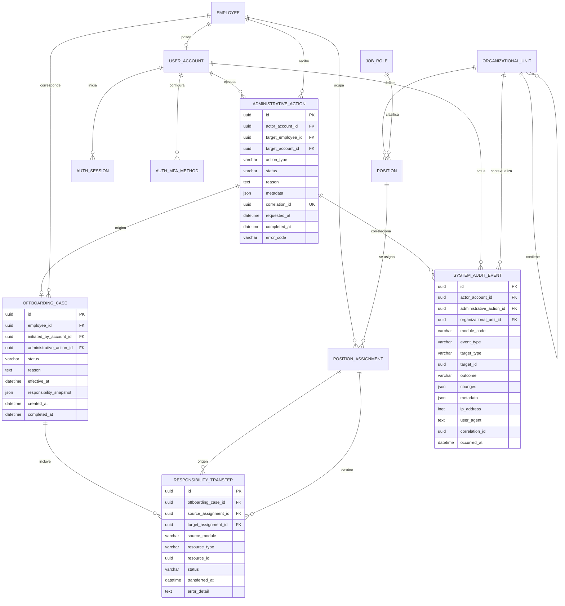

# Módulo administrativo

`boldApp.administrativo` concentra el gobierno operativo de la aplicación. En la primera etapa el acceso se reserva a una cuenta activa con `is_superuser`; `is_staff` no concede acceso. Esto representa al dueño de la empresa mientras el módulo de Permisos incorpora capacidades administrativas delegables.

## Alcance

- Dashboard global con métricas organizacionales, seguridad y tarjetas aportadas por cada módulo.
- Directorio de empleados, creación de cuenta e invitación de un solo uso.
- Asignación de plazas y edición del nombre del empleado.
- Recuperación de contraseña por correo; la administración nunca asigna, devuelve ni conoce la contraseña.
- Consulta y cierre de sesiones, restablecimiento de MFA, activación y desactivación de cuentas.
- Baja de empleados con inventario previo y transferencia transaccional de responsabilidades.
- Catálogos de unidades, cargos y plazas, sin borrado físico.
- Auditoría combinada de Administración, Autenticación, Permisos y proveedores de módulos.

Las acciones críticas exigen una sesión del dueño con MFA verificado en los últimos `ADMIN_STEP_UP_MFA_SECONDS` segundos y un motivo explícito. El valor predeterminado es 600 segundos.

## Arquitectura modular

Cada módulo de contenido puede registrar un proveedor en `administrative_modules`. Un proveedor puede aportar `dashboard`, `activity`, `audit_events`, `offboarding_preview` y `transfer_offboarding`.

Tareas es el primer proveedor, no una dependencia conceptual del módulo administrativo. Calendario, Contabilidad, Clientes u otros módulos pueden incorporarse mediante el mismo contrato.

## Tablas nuevas

- `administrative_actions`: solicitud, actor, objetivo, motivo, estado y correlación de cada operación administrativa.
- `offboarding_cases`: expediente de baja, instantánea de responsabilidades y resultado.
- `responsibility_transfers`: trazabilidad por recurso transferido, módulo de origen y asignaciones involucradas.
- `system_audit_events`: auditoría normalizada, append-only, con actor, módulo, resultado, cambios, IP y correlación.

## ERD para el repertorio de diagramas



## API

```text
GET    /api/v2/administration/dashboard/
GET    /api/v2/administration/audit-events/
GET    /api/v2/administration/organization/
GET    /api/v2/administration/employees/
POST   /api/v2/administration/employees/
PATCH  /api/v2/administration/employees/{id}/
POST   /api/v2/administration/employees/{id}/resend-invitation/
POST   /api/v2/administration/employees/{id}/assign-position/
GET    /api/v2/administration/employees/{id}/sessions/
POST   /api/v2/administration/employees/{id}/revoke-sessions/
POST   /api/v2/administration/employees/{id}/send-password-reset/
POST   /api/v2/administration/employees/{id}/reset-mfa/
POST   /api/v2/administration/employees/{id}/deactivate-account/
POST   /api/v2/administration/employees/{id}/reactivate-account/
GET    /api/v2/administration/employees/{id}/offboarding-preview/
POST   /api/v2/administration/employees/{id}/offboard/
GET    /api/v2/administration/sessions/
DELETE /api/v2/administration/sessions/{id}/
GET    /api/v2/administration/actions/
GET    /api/v2/administration/offboarding-cases/
GET    /api/v2/administration/units/
POST   /api/v2/administration/units/
PATCH  /api/v2/administration/units/{id}/
GET    /api/v2/administration/roles/
POST   /api/v2/administration/roles/
PATCH  /api/v2/administration/roles/{id}/
GET    /api/v2/administration/positions/
POST   /api/v2/administration/positions/
PATCH  /api/v2/administration/positions/{id}/
```

La auditoría acepta `module`, `event_type`, `outcome`, `search`, `date_from`, `date_to` y paginación. Los catálogos no exponen `DELETE`; los registros históricos y las relaciones se conservan.

## Preparación y pruebas

No se crea un dueño privilegiado desde la seed para evitar credenciales administrativas predecibles en despliegues. En desarrollo se puede promover una cuenta existente desde la consola:

```powershell
cd backend
..\.venv\Scripts\python.exe manage.py shell -c "from boldApp.core.models import UserAccount; u=UserAccount.objects.get(email='ana@bold.gt'); u.is_superuser=True; u.is_staff=True; u.save()"
..\.venv\Scripts\python.exe manage.py migrate
..\.venv\Scripts\python.exe manage.py test boldApp.administrativo
```

El dueño debe iniciar sesión con MFA para ejecutar acciones sensibles. La navegación mostrará **Administración** únicamente a esa cuenta.
